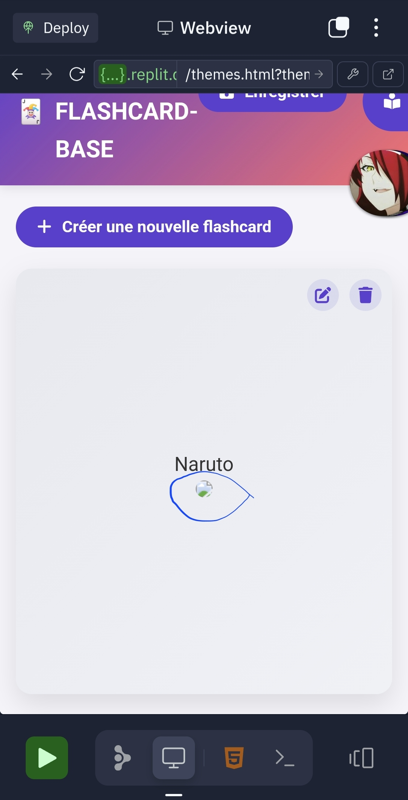

<p align="center">
  
</p>

<h1 align="center">CDS FLASHCARD-BASE</h1>

<p align="center">
  
  
  
</p>

<p align="center">
  Une application web moderne pour créer et réviser des flashcards d'apprentissage de manière efficace et personnalisée.
</p>

## 📚 Présentation

CDS FLASHCARD-BASE est une plateforme d'apprentissage innovante qui utilise la méthode des flashcards pour optimiser la mémorisation à long terme. L'application s'appuie sur des algorithmes de répétition espacée scientifiquement prouvés pour maximiser l'efficacité de vos sessions d'étude.

<details>
  <summary><strong>✨ Pourquoi choisir CDS FLASHCARD-BASE ?</strong></summary>
  <br>
  
  - **Efficacité prouvée** : La répétition espacée est scientifiquement reconnue comme l'une des méthodes les plus efficaces pour la mémorisation à long terme
  - **Personnalisation complète** : Adaptez votre expérience d'apprentissage selon vos préférences et besoins
  - **Interface intuitive** : Une expérience utilisateur soignée et agréable pour un apprentissage sans friction
  - **Suivi de progression** : Analysez vos performances et identifiez vos points forts et faibles
</details>

## ✨ Fonctionnalités

- **Création de decks personnalisés** : Organisez vos flashcards par thèmes, matières ou objectifs d'apprentissage
- **Système de thèmes** : Personnalisez l'interface selon vos préférences visuelles
- **Mode révision intelligent** : Algorithme adaptatif qui se concentre sur vos points faibles
- **Partage de decks publics** : Collaborez et partagez vos connaissances avec la communauté
- **Gestion par clé de session** : Accédez à vos decks depuis n'importe quel appareil grâce à un système de clés de session unique

## 🚀 Installation

```bash
# Cloner le dépôt
git clone https://github.com/votre-username/cds-flashcard-base.git

# Accéder au répertoire
cd cds-flashcard-base

# Lancer avec un serveur local (option 1)
npx serve

# Ou simplement ouvrir index.html dans votre navigateur (option 2)
```

## 🌐 Déploiement

### Sur Replit
1. Importez ce dépôt dans votre compte Replit
2. Utilisez le bouton "Run" pour lancer l'application
3. Accédez au menu de déploiement pour publier votre site

### Sur Render
1. Importez ce dépôt depuis GitHub
2. Créez un nouveau "Static Site"
3. Définissez le répertoire de publication comme "/"
4. Aucune commande de build n'est nécessaire

## 📸 Aperçu

<p align="center">
  
</p>

## 🔮 Technologies utilisées

- HTML5 / CSS3 / JavaScript (ES6+)
- LocalStorage pour la persistance des données
- Interface responsive adaptée à tous les appareils

## 👨‍💻 Contribution

Les contributions sont les bienvenues ! N'hésitez pas à fork le projet et à soumettre vos pull requests.

## 📜 Licence

Ce projet est sous licence MIT. Voir le fichier LICENSE pour plus de détails.

## ✒️ Crédit

<p align="center">
  <br>
  Développé avec passion par <strong>Izumi Hearthcliff</strong>
</p>
